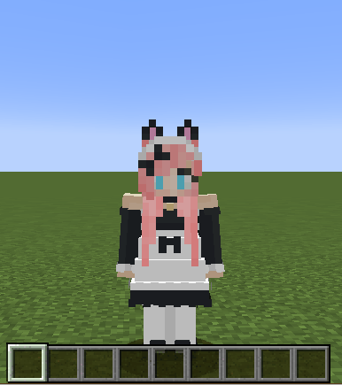
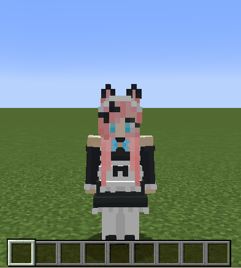
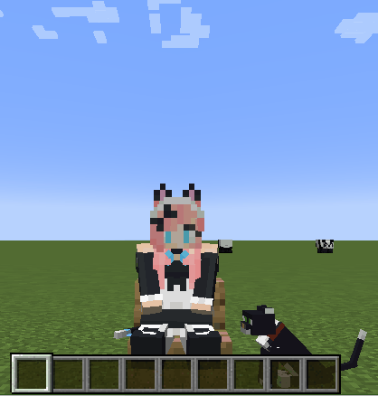
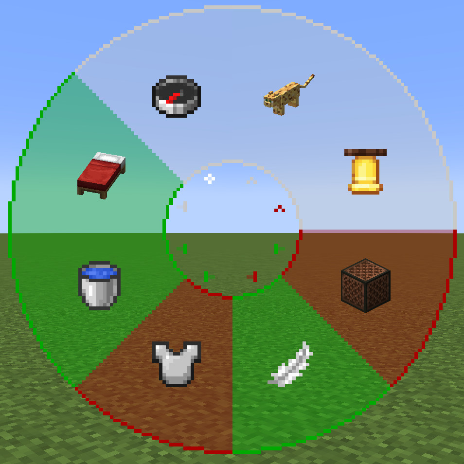

<!-- $inject(locale_link) -->

# CatMaid (猫メイド)
<!-- DESCRIPTION_START -->
This is "Cat maid (猫メイド)", the avatar for [Figura](https://modrinth.com/mod/figura), the skin mod for [Minecraft](https://www.minecraft.net/en-us).

Target figura version: [0.1.4](https://modrinth.com/mod/figura/version/0.1.4+1.20.1)

(Some avatar functions don't work correctly in Minecraft 1.20.4 doe to [a bug in Figura](https://github.com/FiguraMC/Figura/issues/197). I recommend using in Minecraft 1.20.1.)
<!-- DESCRIPTION_END -->

## Features
- Has cat ears, cat tail, and maid skirt.
  - The ears are sometimes animated.
  - The tail wags left and right (can be disabled in [avatar settings](#avatar-settings)).

	

  - The tail stands or dropped depending on the player's health and saturation.

	

- Sometimes meows.
  - Opens mouth when meowing.
  - Her meow changes when low health and saturation.

- Sometimes the ears move.
  - Which one moves is depend on the player's dominant hand.

- Sometimes blinks.
- Her expression will change when taking a damage, low health, or low saturation.

- Smiles or winks in [the action wheel](#the-action-wheel).

  

  

- Players bell sounds when walking and jumping (can be disabled in [avatar settings](#avatar-settings)).
  - The volume of bell sounds will be reduced to 1/5 when sneaking.

- Plays cat hurts sounds when taking a damage.

- The eyes shine when holding the favorite foods. Satisfies and meows when eating them.

  

- Pales when she is sick or eat something inedible.

  

- Sleeps like a cat at bedtime.
  - The view at bedtime ws also changed to match the pose.
  - Purrs at bedtime.

	

- Holds a cake like a maid.
  - The design of the cake is occasionally changed.

  

- Gets wet when touching water.
  - Can flick water droplets off the body by shaking the body.

  

- Will be frightened and tremble when a [warden](https://minecraft.wiki/w/Warden) is nearby her (≒ has the darkness effect).

  

  - Holds the ball not to make sounds and refuses playing animations when she is frightened.

    

- Plays animations when being left alone for a short while (can be disabled in [avatar settings](#avatar-settings)).

  - Touches her bell every 30 seconds.

  

  - Falls asleep after 5 minutes have passed since she was left alone.

  

  

  

- Glows the eyes like a cat when the player has a night vision effect.
  - You cannot see the glowing eyes by yourself because of night vision specifications.
  - Use a shader pack if you really want to check them.

  

- The hair flutters with the player's movement.

  

- Has various types of ears and tail textures based on vanilla cats. You can change them in [avatar settings](#avatar-settings).

  

- Has a summer features! Changes her costume to swimsuit when enabled.
  - Changes a leather helmet to a summer hat.
  - Changes a turtle shell to a snorkel.
    - Raises the snorkel when out of water.

## The action wheel
Figura provides the action wheel with which players can play some actions (emotes, animations, configs, and etc.). It will be shown when holding the action wheel key (default is B key). This avatar also has some actions.

### Page 1

#### Action 1-1. Smile
Meows and smiles.

#### Action 1-2. Wink
Meows and winks.

#### Action 1-3. Shining eyes
Meows and shines her eyes.

#### Action 1-4. Unequaled eyes
Meows and shows unequaled eyes with full of joy.

#### Action 1-5. Surprised
Surprised and sweats. Right-click to pale.

#### Action 1-6. Intimidate
Intimidates against enemies. The hairs on the tail stand on the end. Left-click to intimidate softly, Right-click to intimidate hard.

#### Action 1-7. Downhearted
Downhearted. Right-click to pale.

### Page 2

#### Action 2-1. Pat (head)
You will pat her head (The displayed arm will be your skin).

#### Action 2-2. Pat (tails)
You will pat her tail (The displayed arm will be your skin). This makes her angry because cats hate being touched their tails.

#### Action 2-3. Sitting down
Sits down there. She will stand up when playing this action again. She will also stand up when moving, jumping, or sneaking while setting down.

#### Action 2-4. Body shaking
Shakes her body. This action can flick water droplets off the body when getting out of water/rain.

#### Action 2-5. Toggle summer feature
Toggles summer feature.

#### Action 2-7. Open avatar settings
Opens [avatar settings](#avatar-settings).

## Avatar settings
You can open this avatar settings by clicking [action 2-7](#action-2-7-open-avatar-settings). You can close it by closing the action wheel once.

### Action 1. Ears and tail type
Changes type of the ears and tail. Scroll to select the option and close the action wheel to confirm.

### Action 2. Change volume of bell sounds
Changes the volume of bell sounds. Scroll to increase or decrease in 5% increments and close the action wheel to confirm.

### Action 3. Toggle cat's meow
Toggles whether periodic cat's meows are played or not.

### Action 4. Toggle tail wagging
Toggles if the avatar wags its tail or not.

### Action 5. Toggle armors visible
Toggles whether equipped armors are visible or not. The maid skirt will be hidden not to interfere with the armors while equips them. This setting will only affects to vanilla armors.

### Action 6. Toggle auto body shaking
Toggles whether [the avatar shakes its body](#action-2-4-body-shaking) or not when getting wet.

### Action 7. Toggle afk actions
Toggles if afk actions are played or not.

<!-- $inject(how_to_use) -->

## Textures
In this section, I will explain structures of the textures. The skin texture are created based on the vanilla skin, so you can change the skin of the avatar by replacing the texture. Only those directly related to the vanilla skin are explained here.

### main.png
This is the main texture.

1. Vanilla skin
   - Only supports the slim model.
   - The eyes (and mouth) should be drawn in [eyes.png](#eyespng) and [mouth.png](#mouthspng) separately.
2. The ribbon to be attached to the tail
   - It's the same as the ribbon to be attached to the bell.
3. Bell
4. Front hair
5. Back hair
6. The ribbon on the back
7. Maid skirt
8. Over layer of the maid skirt
9. Swim suit skin for summer feature

### eyes.png
This texture is for the eyes.

- Textures of the eyes and mouth have doubled resolution compared to other textures.
- It is easier to understand if you divide this texture into 6x6 pixels.
- The parts are arranged in the following order from top to bottom.
  - Non-glowing areas of the right eye (eyebrows, etc.)
  - Glowing areas of the right eye
  - Non-glowing areas of the left eye (eyebrows, etc.)
  - Glowing areas of the left eye
- The eyes are arranged in the following order from left to right.
  - Normal eyes
  - Shining eyes
  - Surprised eyes
  - Surprised eyes while being weak (low health, saturation)
  - Intimidated eyes
  - Intimidated eyes while being weak (low health, saturation)
  - Downhearted eyes
  - Downhearted eyes while being weak (low health, saturation)
  - Weak (low health, saturation) eyes
  - Sleeping eyes
  - Closed eyes

### mouths.png
This texture is for the mouth.

- The mouths are arranged in the following order from left to right.
  - Closed mouth
  - Opened mouth
  - Intimidated mouth

<!-- $inject(notes) -->

## Credits
- Bell sound: Otojin "Bell sound 04" (音人「鈴の音04」) ( https://on-jin.com/sound/sei.php?bunr=ベル・鐘・鈴&kate=道具 )