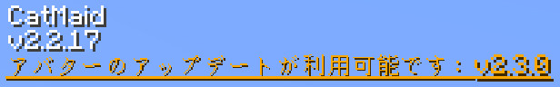

<!-- $inject(locale_link) -->

# CatMaid (猫メイド)
<!-- DESCRIPTION_START -->
MinecraftのスキンMod「[Figura](https://modrinth.com/mod/figura)」向けスキン「CatMaid（猫メイド）」です。

ターゲットFiguraバージョン：[0.1.5](https://modrinth.com/mod/figura/version/0.1.5b+1.21.4)

<!-- DESCRIPTION_END -->

## 特徴
- 猫耳と尻尾とメイドスカートが追加されています。
  - 耳はたまにアニメーションします。
  - 尻尾は左右に振れます（[アバター設定](#アバター設定)で無効に出来ます）。

	

  - 尻尾は現在のHP、満腹度に応じて上げ下げされます。

	

- 時々にゃーにゃー鳴きます。
  - 鳴く時は口が開きます。
  - 低HP時、低満腹度時は声が変化します。
- 時々耳が動きます。
  - プレイヤーの利き手に応じてどちらが動くかが変化します。
- 時々瞬きします。
- ダメージを受けた時、低HP時、低満腹度時に目が変化します。

- [アクションホイール](#アクションホイール12)でニッコリしたり、ウィンクしたりします。

  

  

- 歩いたり、跳んだりすると鈴の音がなります（[アバター設定](#アバター設定)で無効に出来ます）。
  - スニーク時は音量が1/5になります。

- ダメージを受けると「ネコがダメージを受ける」サウンドが再生されます。

- お気に入りの食べ物を手に持つと目がキラキラ光り、食べると満足して「ニャー」と鳴きます。

  

- 具合が悪かったり、とても食べられないような物を食べると顔を青ざめます。

  

- 就寝時は猫っぽく寝ます。
  - 就寝時の視点もポーズに合わせて変更されています。
  - 就寝時はゴロゴロ言います。

	

- ケーキの持ち方がメイドっぽくなっています。
  - たまにレアなデザインのケーキが出現します。

  

- 水に触れると「ずぶ濡れ」状態になります。
  - 水から上がった時に「ブルブル」アクションをすると体に付いた水滴を飛ばせます。

  

- ウォーデンが近くにいる（暗闇デバフを受ける）と、怯えて震えます。
  - この状態では、鈴を押さえて音が出ないようにしたり（首を絞めている訳ではないよ！）、エモートを拒否するようになります。

  

  

- 放置すると専用アクションを起こします（[アバター設定](#アバター設定)で無効に出来ます）。
  - 30秒おきに鈴をいじります。

  

  - 5分放置すると居眠りします。

  

  

  

- 暗視が付与されている時は、猫のように目が光ります。
  - 暗視の仕様上、自分自身では目が光るのを確認できません。
  - どうしても確認したい方は、シェーダーパックを使用すると確認出来ます。

  

- プレイヤーが動くと髪がたなびきます。

  

- バニラのネコのテクスチャを基にした、複数種類の耳と尻尾のテクスチャを用意しています。[アバター設定](#アバター設定)でお好みのテクスチャに変更出来ます。

  

- 夏機能搭載！有効にすると水着姿になります。
  - 夏機能が有効な場合は革の帽子がサマーハットに変化します。
  - 夏機能が有効な場合は亀の甲羅ヘルメットがシュノーケルに変化します。
    - 水から上がっている場合はシュノーケルを上に上げます。

## アクションホイール（1/2）
Figuraには、アクションホイールキー（デフォルトは「B」キー）を押すことで、エモートなどを実行できるリングメニューが実装されています。このアバターにもいくつかのアクションが用意されています。

### ページ1

#### アクション1-1. スマイル
ネコの鳴き声が再生されると同時に笑顔になります。

#### アクション1-2. ウィンク
ネコの鳴き声が再生されると同時にウィンクします。

#### アクション1-3. キラキラ
ネコの鳴き声が再生されると同時に目を輝かせます。

#### アクション1-4. > <（不等号目）
ネコの鳴き声が再生されると同時に元気いっぱいの（> <）目になります。

#### アクション1-5. ビックリ
ビックリして、汗をかきます。右クリックで青ざめます。

#### アクション1-6. 威嚇
敵に対して威嚇します。尻尾の毛が逆立ちます。左クリックで弱い威嚇、右クリックで強い威嚇になります（下の画像は強い威嚇です）。

#### アクション1-7. しょんぼり
しょんぼりします。右クリックで青ざめます。

### ページ2

#### アクション2-1. ナデナデ（頭）
プレイヤー自身がアバターの頭を撫でます（表示される腕はプレイヤーのスキンになります）。

#### アクション2-2. ナデナデ（尻尾）
プレイヤー自身がアバターの尻尾を撫でます（表示される腕はプレイヤーのスキンになります）。猫は尻尾を触られるのがいやらしいので、尻尾を触ると起こります。

#### アクション2-3. おすわり
その場に座ります。もう一度アクション実行で立ち上がります。座っている時に動いたり、ジャンプしたり、スニークしたりすると自動で立ち上がります。

#### アクション2-4. ブルブル
体をブルブル震わせます。体が濡れている場合は、水から上がった時にこのアクションを行うことで体に付いた水分を飛ばせます。

#### アクション2-5. 夏機能のオン/オフ
夏機能のオン/オフを切り替えます。

#### アクション2-7. 設定画面を開く
クリックして[設定画面](#アバター設定)を開きます。

## アバター設定
[アクション2-7](#アクション2-7設定画面を開く)を実行するとこの画面が表示されます。一度アクションホイールを閉じると、設定画面を閉じることができます。

### アクション1. 猫の種類
猫耳と尻尾の種類を変更します。スクロールで猫の種類を変更し、アクションホイールを閉じると確定します。

### アクション2. 鈴の音量
鈴の音量を変更します。スクロールで5%刻みに増減し、アクションホイールを閉じると確定します。

### アクション3. 猫の鳴き声の切り替え
通常時の猫の鳴き声を有効にするかどうかを設定できます。

### アクション4. 尻尾振りの切り替え
尻尾を振るかどうかを設定できます。

### アクション5. 防具の非表示の切り替え
防具を表示するかどうかを設定できます。

### アクション6. 自動ブルブルの切り替え
濡れている際に自動的に[ブルブル](#アクション2-4ブルブル)を実行するかどうかを設定できます。

### アクション7. AFKアクションの切り替え
放置時に特別なアクションを実行するかどうかを設定できます。

### アクション8. アバターのアップデート確認
左クリックすると、アバターのアップデートがあるかどうかを確認します。アップデートの確認が失敗しても、このアクションからアップデートの確認を再試行できます。なお、ここより手動でアップデートを確認するほかに、1日1回自動的にアップデートの確認を行います。

> [!IMPORTANT]
> アップデートの確認を行うには、Figuraの設定から、「Allow Networking」を有効にし、`api.github.com`を通信許可リストに入れる必要があります！

> [!CAUTION]
> FiguraのNetworking機能を有効にする際に、ネットワークフィルターを「Whitelist」以外で運用するのは危険です。このアバターでは安全なリンクを利用しますが、他のプレイヤーのアバターが利用するリンクが安全である保障はありません。また、この機能を使用して発生したいかなる損害の責任も負いかねます。

> [!WARNING]
> アップデートの確認を短時間で繰り返し行うと、一時的にGitHub側から制限が課せられ、しばらくの間アップデートの確認を行えなくなります。

右クリックすると、最新のアバターのダウンロードリンクをクリップボードにコピーします。お使いのブラウザからダウンロードページにアクセスしてください。なお、1回もアップデートの確認を行っていなかったり、長期間アップデートの確認を行っていなかったりする場合は正常なリンクを取得できませんのでご注意ください。

## アバターのバージョン表示
v2.3.0より、アクションホイールを開けている際に、画面左上に現在使用中のアバターのバージョンとアップデートの有無が表示されます。

アップデートの確認は、1日1回自動で行われますが、[アクションホイール](#アクション8-アバターのアップデート確認)より手動で行うこともできます。

新しいアバターのバージョンが利用可能な場合は、通知が送信されます。[アクションホイール](#アクション8-アバターのアップデート確認)より最新バージョンのダウンロードリンクが取得できますので、お使いのブラウザからアクセスしてください。

> [!IMPORTANT]
> アップデートの確認を行うには、Figuraの設定から、「Allow Networking」を有効にし、`api.github.com`を通信許可リストに入れる必要があります！

> [!CAUTION]
> FiguraのNetworking機能を有効にする際に、ネットワークフィルターを「Whitelist」以外で運用するのは危険です。このアバターでは安全なリンクを利用しますが、他のプレイヤーのアバターが利用するリンクが安全である保障はありません。また、この機能を使用して発生したいかなる損害の責任も負いかねます。

> [!WARNING]
> アップデートの確認を短時間で繰り返し行うと、一時的にGitHub側から制限が課せられ、しばらくの間アップデートの確認を行えなくなります。

<!-- $inject(how_to_use) -->

## テクスチャ
このアバターのテクスチャは以下の通りです。バニラのスキンをベースに作られているので、テクスチャを書き換えてスキンを変更出来ます。なお、バニラスキンと直接かかわりがあるもののみ説明します。

### main.png
アバターのメイン部分となるテクスチャです。

1. バニラスキン
   - スリムモデルのみ対応です。
   - 目（と口）は分離して[eyes.png](#eyespng)や[mouths.png](#mouthspng)に描いて下さい。
2. 尻尾に付けるリボン
   - 鈴に付けるリボンと共用です。
3. 鈴
4. 前髪
5. 後ろ髪
6. 背中のリボン
7. メイドスカート
8. メイドスカートのオーバーレイ
9. 夏機能用の水着スキン

### eyes.png
アバターの目のテクスチャです。

- 目と口だけは他の部位と比べて2倍の解像度になっています。
- それぞれ6×6ピクセルに区切ると分かりやすいです。
- 上から以下の順でパーツ分けされています。
  - 右目の光らない部分（眉毛等）
  - 右目の光る部分
  - 左目の光らない部分（眉毛等）
  - 左目の光る部分
- 目は左から以下の順で配置されています。
  - 通常の目
  - キラキラした目
  - 驚いた目
  - 低HP時、低満腹度時に驚いた目
  - 威嚇時の目
  - 低HP時、低満腹度時の威嚇時の目
  - しょんぼりの目
  - 低HP時、低満腹度時のしょんぼりの目
  - 低HP時、低満腹度時の目
  - 眠い時の目
  - 閉じている目

### mouths.png
アバターの口のテクスチャです。

- それぞれ2×4ピクセルに区切ると分かりやすいです。
- 口は左から以下の順で配置されています。
  - 閉じている口
  - 開いている口
  - 威嚇時の口

<!-- $inject(notes) -->

## クレジット
- 鈴の音：音人「鈴の音04」（ https://on-jin.com/sound/sei.php?bunr=ベル・鐘・鈴&kate=道具 ）