# CatMaid（猫メイド）

MinecraftのスキンMod「[Figura](https://github.com/Moonlight-MC/Figura)」向けスキン「CatMaid（猫メイド）」です。


🌊 **It's summer time!** 🌊

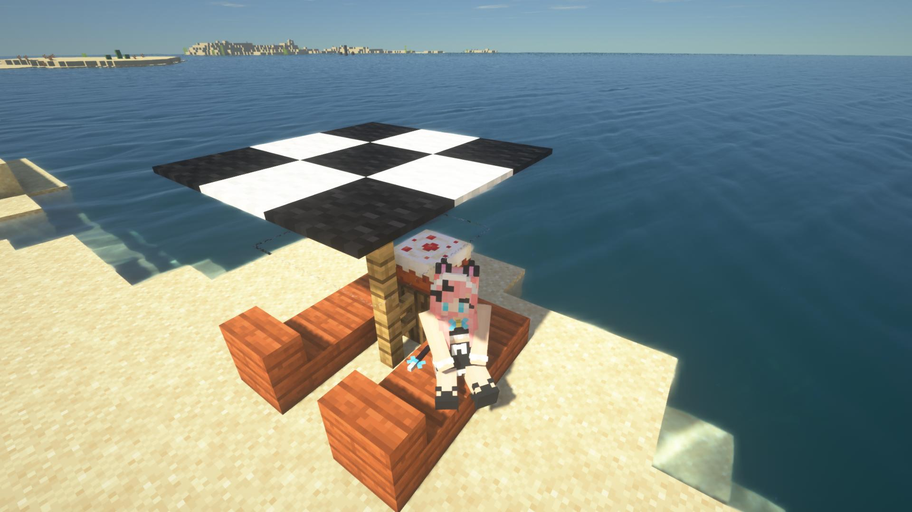

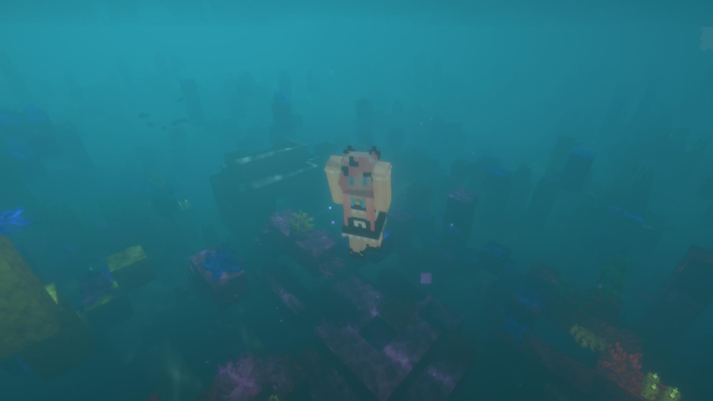

詳しくは[こちら](#アクション7夏機能のオンオフ)

## このブランチについて
このブランチのアバター、[Figura-0.1.0-rc6](https://github.com/Kingdom-of-The-Moon/FiguraRewriteRewrite)向けのアバターです。[Figura-0.1.0-rc6](https://github.com/Moonlight-MC/Figura)では使用出来ません。[Figura-0.0.8](https://github.com/Moonlight-MC/Figura)のアバターを使用したい場合は、[こちら](https://github.com/Gakuto1112/CatMaid)からダウンロードして下さい。

[Figura-0.1.0-rc6]((https://github.com/Kingdom-of-The-Moon/FiguraRewriteRewrite))は[こちら](https://discord.com/channels/805969743466332191/959863825581101116/1012161422106574878)からダウンロード出来ます。

また、[Figura-0.1.0-rc6](https://github.com/Kingdom-of-The-Moon/FiguraRewriteRewrite)の機能不足により、一部の機能は現時点（2022/7/18）では実装できませんでした。

### 実装不可能なもの
- 設定画面（詳しくは[こちら](#アバター設定について)）
- ~~マルチプレイにおける、クライアント間のアクション同期（ping）~~
  - ~~相手に向かってエモートを実行しても相手はそのエモートを見ることが出来ません。~~
  - [Figura-0.1.0-rc1](https://github.com/Kingdom-of-The-Moon/FiguraRewriteRewrite)で実装されました。本アバターへの実装作業中です。
- ~~プレイヤーの頭（被り物）の消去~~
  - [Figura-0.1.0-rc1](https://github.com/Kingdom-of-The-Moon/FiguraRewriteRewrite)で実装されました。本アバターへの実装作業中です。
- アクションホイールでの、顔アニメーションによるエモートのプレビュー
  - 代替のアイコンを使用しています。
- エリトラや~~手持ちアイテム~~の移動
  - 代替処理として、移動が必要な場合は非表示にしています。
  - ~~オウムと望遠鏡はどうにもなりませんでした。~~
  - 一部は[Figura-0.1.0-rc1](https://github.com/Kingdom-of-The-Moon/FiguraRewriteRewrite)で実装されました。本アバターへの実装作業中です。

## 特徴
- 猫耳と尻尾とメイドスカートが追加されています。
  - 耳はたまにアニメーションします。
  - 尻尾は左右に振れます（[アバター設定](#アバター設定について)で無効に出来ます）。

	

  - 尻尾は現在のHP、満腹度に応じて上げ下げされます。

	

- 時々にゃーにゃー鳴きます。
  - 鳴く時は口が開きます。
  - 低HP時、低満腹度時は声が変化します。
- 時々耳が動きます。
  - プレイヤーの利き手に応じてどちらが動くかが変化します。
- 時々瞬きします。
- ダメージを受けた時、低HP時、低満腹度時に目が変化します。
- [アバター設定](#アバター設定について)でニッコリしたり、ウィンクしたりします。
  
  

- 歩いたり、跳んだりすると鈴の音がなります（[アバター設定](#アバター設定について)で無効に出来ます）。
  - スニーク時は音量が1/5になります。
- ダメージを受けると「ネコがダメージを受ける」サウンドが再生されます。
- お気に入りの食べ物を手に持つと目がキラキラ光り、食べると満足して「ニャー」と鳴きます。

  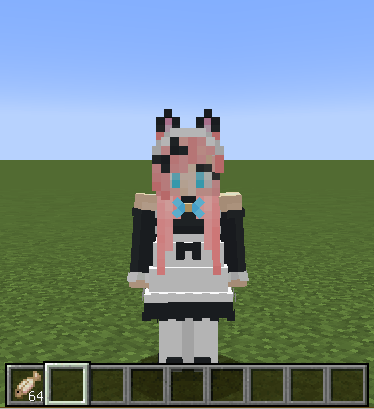

- 具合が悪かったり、とても食べられないような物を食べると顔を青ざめます。

  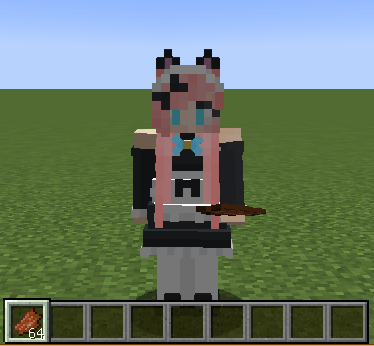

- 就寝時は猫っぽく寝ます。
  - 就寝時の視点もポーズに合わせて変更されています。
  - 就寝時はゴロゴロ言います。

	

- ケーキの持ち方がメイドっぽくなっています。
  - たまにレアなデザインのケーキが出現します。

  

- 水に触れると「ずぶ濡れ」状態になります。
  - 水から上がった時に「ブルブル」アクションをすると体に付いた水滴を飛ばせます。

  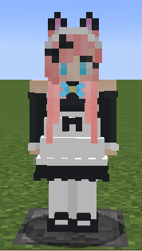

- 溶岩や火に入って燃えてしまうと、黒焦げになってしまいます（[アバター設定](#アバター設定について)で無効に出来ます）。
  - 雨や水に当たるとより早く冷めます。

  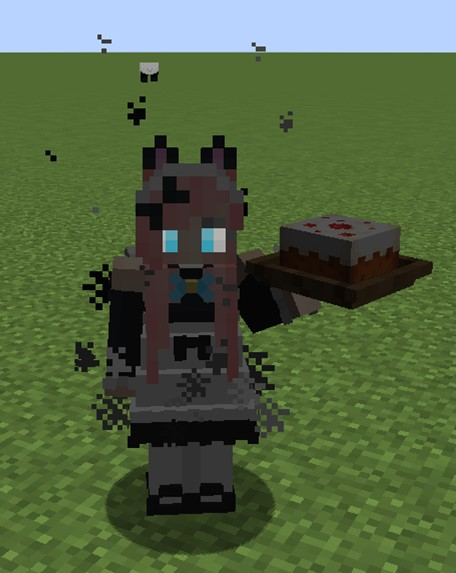

- ウォーデンが近くにいる（暗闇デバフを受ける）と、怯えて震えます。
  - この状態では、鈴を押さえて音が出ないようにしたり（首を絞めている訳ではないよ！）、エモートを拒否するようになります。

  

  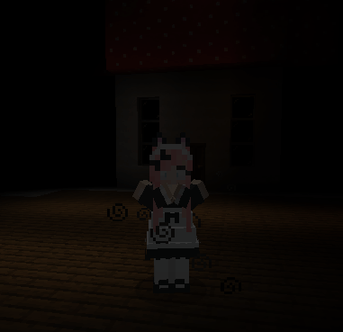

- 放置すると専用アクションを起こします（[アバター設定](#アバター設定について)で無効に出来ます）。
  - 30秒おきに鈴をいじります。

  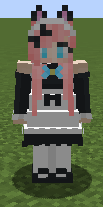

  - 5分放置すると居眠りします。

  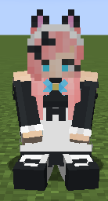
  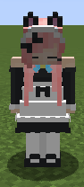
  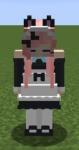

- 暗視が付与されている時は、猫のように目が光ります。
  - 暗視の仕様上、自分自身では目が光るのを確認できません。
  - どうしても確認したい方は、シェーダーパックを使用すると確認出来ます。

  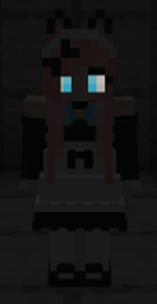

- プレイヤーが動くと髪がたなびきます。

  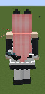

- バニラのネコのテクスチャを基にした、複数種類の耳と尻尾のテクスチャを用意しています。[アバター設定](#アバター設定について)でお好みのテクスチャに変更出来ます。

  

- 夏機能搭載！有効にすると水着姿になります。
  - 夏機能が有効な場合は革の帽子がサマーハットに変化します。
  - 夏機能が有効な場合は亀の甲羅ヘルメットがシュノーケルに変化します。
    - 水から上がっている場合はシュノーケルを上に上げます。

  

## アクションホイール（1/2）
このスキンにはいくつかのアクションが用意されています。

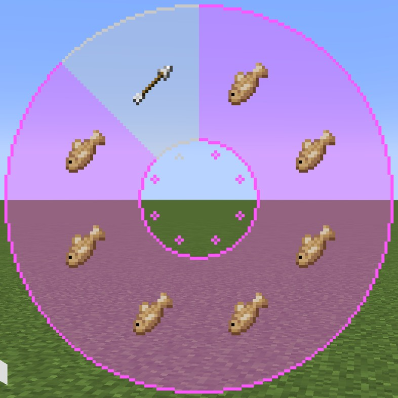

### アクション1-1：スマイル
- ネコの鳴き声が再生されると同時に笑顔になります。
- 「みゃ～」


### アクション1-2：ウィンク
- ネコの鳴き声が再生されると同時にウィンクします。
- 「みゃ～」


### アクション1-3：キラキラ
- ネコの鳴き声が再生されると同時に目を輝かせます。
- 「みゃあ～...！」


### アクション1-4：> <（不等号目）
- ネコの鳴き声が再生されると同時に元気いっぱいの（> <）目になります。
- 「みゃっ！」


### アクション1-5：ビックリ
- ビックリして、汗をかきます。（以前実装したものを再実装したものになります）
- 右クリックで青ざめます。
- 「みゃっ！？」

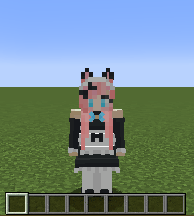

### アクション1-6：威嚇
- 敵に対して威嚇します。
- 尻尾の毛が逆立ちます。
- 左クリックで弱い威嚇、右クリックで強い威嚇になります（下の画像は強い威嚇です）。
- 「ごしゅじんをまもるのです！」


### アクション1-7：しょんぼり
- しょんぼりします。
- 右クリックで青ざめます。
- 「ごしゅじん...」


## アクションホイール（2/2）
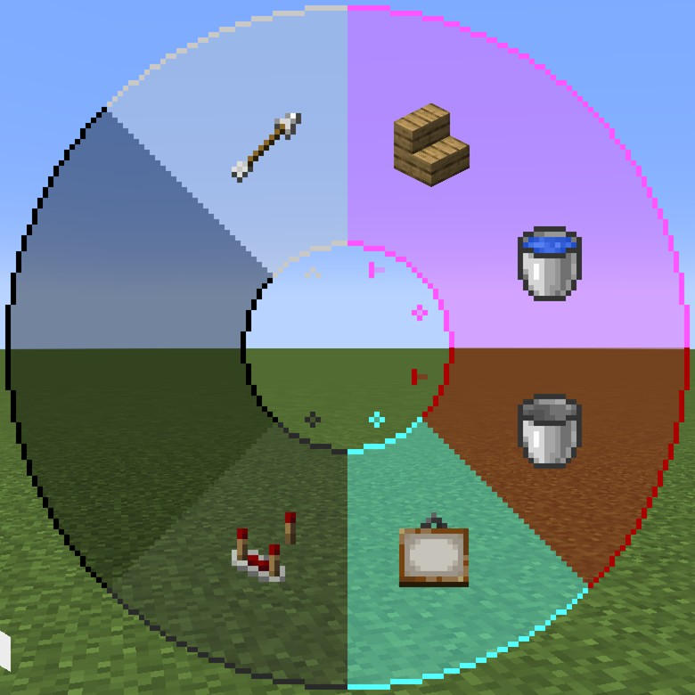

### アクション2-1：ナデナデ（頭）
- プレイヤー自身がアバターの頭を撫でます。
- 表示される腕はプレイヤーのスキンになります。
- 「ごしゅじんのて、あたたかい...」

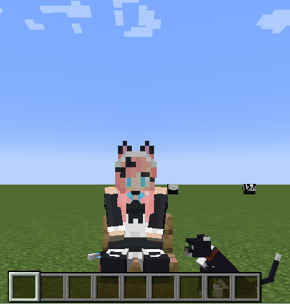

### アクション2-1：ナデナデ（尻尾）
- プレイヤー自身がアバターの尻尾を撫でます。
- 表示される腕はプレイヤーのスキンになります。
- 猫は尻尾を触られるのがいやらしいので、尻尾を触ると起こります。
- 「ごしゅじんでもさわっちゃいけないモノがあるんです！」

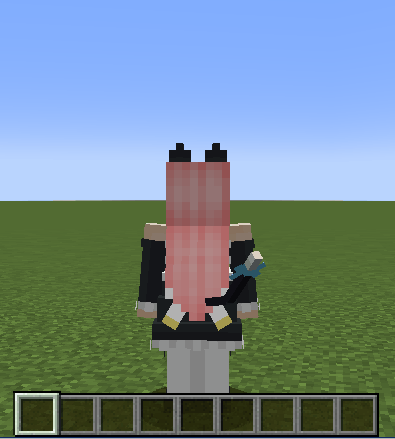


### アクション2-3：おすわり
その場に座ります。もう一度アクション実行で立ち上がります。座っている時に動いたり、ジャンプしたり、スニークしたりすると自動で立ち上がります。

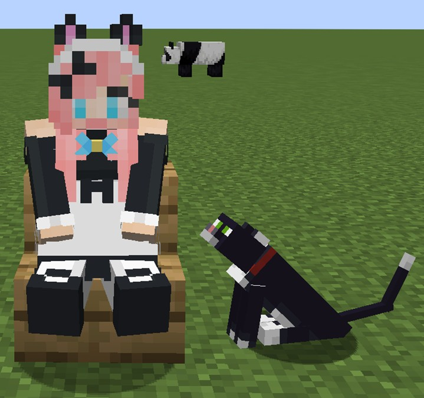

### アクション2-4：ブルブル
体をブルブル震わせます。体が濡れている場合は、水から上がった時にこのアクションを行うことで体に付いた水分を飛ばせます。

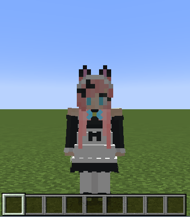

### アクション2-5：夏機能のオン/オフ
夏機能のオン/オフを切り替えます。


### アクション2-6：シネマティックモード
[シネマティックモード](#シネマティックモードについて)を開始します。

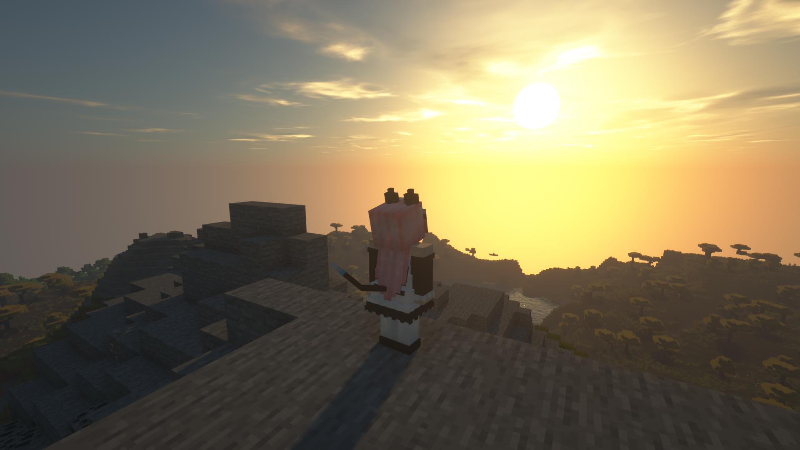
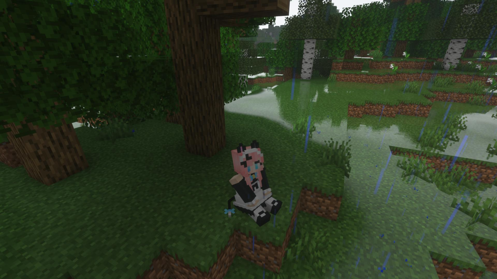

（シェーダーパックはご自身でご用意下さい）

### アクション2-7：設定画面を開く
~~クリックして設定画面を開きます。~~　**2022/7/18現在、機能していません！！**

### アクション8（共通）：ページ切り替え
ボタン上でスクロールするとページが切り替わります。

## シネマティックモードについて
シネマティックモードはプレイヤーの頭の向きに関わらずカメラを自由に回転させることが出来るモードです。スクリーンショットの撮影に向いているかもしれません。シネマティックモードは三人称視点のみ有効です。

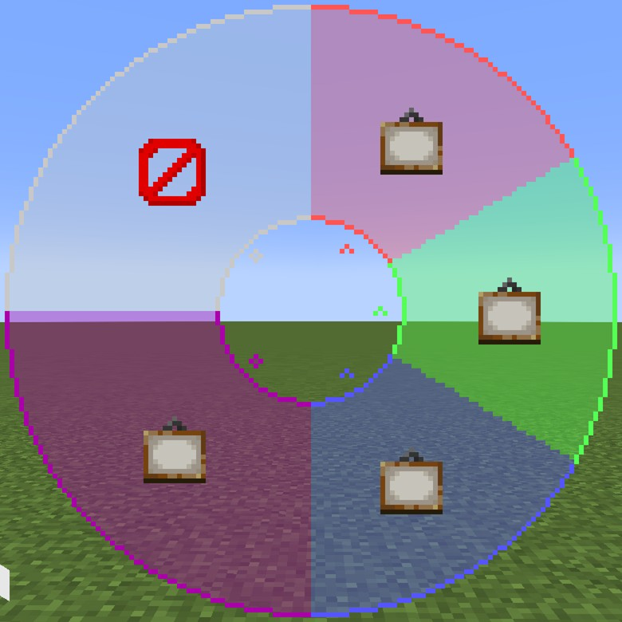

### アクション1：カメラピッチ調整
ボタン上でスクロールするとカメラのピッチを動かせます。

### アクション2：カメラロール調整
ボタン上でスクロールするとカメラのロールを動かせます。

### アクション3：カメラヨー調整
ボタン上でスクロールするとカメラのヨーを動かせます。

### アクション4：カメラの向きリセット
カメラの向きをリセットして初期値に戻します。

### アクション5：シネマティックモード終了
シネマティックモードを終了して通常モードに戻します。

## アバター設定について
2022/7/18現在、ゲーム内での設定画面が実装出来ないので、代わりに[設定画面ファイル（./scripts/config.lua）](./scripts/config.lua)を直接編集して下さい。

- 設定値以外の所は編集しないで下さい。正常に動作しなくなるもとになります。

```lua
ConfigClass.Language = "jp"
ConfigClass.CatType = "ORIGINAL"
ConfigClass.SkinName = "Vinny"
ConfigClass.MeowSound = true
ConfigClass.BellSound = true
ConfigClass.WaveTail = true
ConfigClass.HideArmor = true
ConfigClass.AutoShake = true
ConfigClass.AFKAction = true
ConfigClass.BurnEffect = true
ConfigClass.UseSkinName = true
ConfigClass.CinematicModeCamera = {
	PitchInit = 30,
	RollInit = 0,
	YawInit = 45
}
```

| 項目 | 説明 | 有効な値 | 初期値 |
| - | - | - | - |
| ```ConfigClass.CatType``` | 猫耳と尻尾に使用するテクスチャの種類です。 | ```string``` "ORIGINAL", "ALL_BLACK", "BLACK", "BRITISH_SHORTHAIR", "CALICO", "GLEY_TABBY", "JELLIE", "OCELOT", "PERSIAN", "RAGDOLL", "RED", "SIAMESE", "TABBY", "WHITE" | ORIGINAL |
| ```ConfigClass.SkinName``` | ```ConfigClass.UseSkinName```が```true```の時に使用される名前です。 | ```string``` | Vinny |
| ``` ConfigClass.MeowSound ``` | 定期的に猫の鳴き声を発するかどうかです。 | ```boolean``` | ```true``` |
| ```ConfigClass.BellSound``` | 鈴の音を鳴らすかどうかです。**カスタムサウンドを再生する権限が無い場合は代替の音が使用されます。** | ```boolean``` | ```true``` |
| ```ConfigClass.WaveTail``` | 尻尾を揺らすかどうかです。 | ```boolean``` | ```true``` |
| ```ConfigClass.HideArmor``` | 防具を隠すかどうかです。 | ```boolean``` | ```true``` |
| ```ConfigClass.AutoShake``` | 水から上がった時に自動でブルブルアクションを実行するかどうかです。 | ```boolean``` | ```true``` |
| ```ConfigClass.AFKAction``` | 放置している時に[専用アクション](#特徴)を再生するかどうかです。 | ```boolean``` | ```true``` |
| ```ConfigClass.BurnEffect``` | 黒焦げになる視覚効果を有効にするかどうかです。 | ```boolean``` | ```true``` |
| ```ConfigClass.UseSkinName``` | ```ConfigClass.SkinName```をプレイヤー名として使用すかどうかです。**スキン名はFiguraを導入しているかつ、あなたの信用度をTrustedに設定しているプレイヤーにのみに表示されます。それ以外のプレイヤーには通常のプレイヤー名が表示されます。また、サーバー側にはスキン名は反映されません。** | ```boolean``` | ```true``` |
| ```ConfigClass.CinematicModeCamera.PitchInit``` | シネマティックモードのカメラのピッチの初期値です。 | ```integer``` -90 - 90 | 30 |
| ```ConfigClass.CinematicModeCamera.RollInit``` | シネマティックモードのカメラのロールの初期値です。 | ```integer``` -180 - 180 | 0 |
| ```ConfigClass.CinematicModeCamera.YawInit``` | シネマティックモードのカメラのヨーの初期値です。 | ```integer``` 0 - 360 | 45 |

## テクスチャ
このアバターのテクスチャは以下の通りです。バニラのスキンをベースに作られているので、テクスチャを書き換えてスキンを変更出来ます。なお、バニラスキンと直接かかわりがあるもののみ説明します。

<**追記**> 現在、Figuraは、モデルファイル内にあるテクスチャを参照しているようであり、単純にテクスチャを編集したり、置き換えたりするだけではテクスチャが反映されません。取り急ぎ、**[BlockBench](https://www.blockbench.net/)で、一度開いて保存すれば反映されるようです**。あるいは、[TextureInjector.py](TextureInjector.py)を実行すると、[BlockBench](https://www.blockbench.net/)を使用せずにテクスチャを適用できます（実行には[Python](https://www.python.org/)が必要です）。

### [main.png](./textures/main.png)
アバターのメイン部分となるテクスチャです。

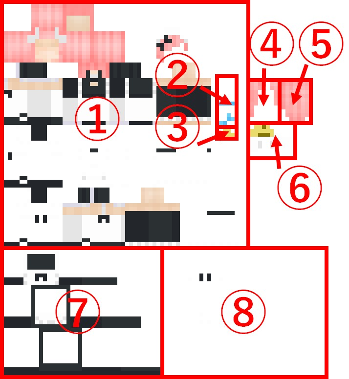

1. バニラスキン
   - スリムモデルのみ対応です。
   - 目（と口）は分離して[mouths.png](./textures/mouths.png)に描いて下さい。
2. 尻尾に付けるリボン
   - 鈴に付けるリボンと共用です。
3. 鈴
4. 前髪
5. 後ろ髪
6. 背中のリボン
7. メイドスカート
8. メイドスカートのオーバーレイ
9. 夏機能用の水着スキン

### [eyes.png](./textures/eyes.png)
アバターの目のテクスチャです。

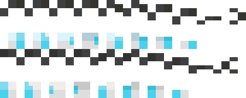

- 目と口だけは他の部位と比べて2倍の解像度になっています。
- それぞれ6×6ピクセルに区切ると分かりやすいです。
- 上から以下の順でパーツ分けされています。
  - 右目の光らない部分（眉毛等）
  - 右目の光る部分
  - 左目の光らない部分（眉毛等）
  - 左目の光る部分
- 目は左から以下の順で配置されています。
  - 通常の目
  - キラキラした目
  - 驚いた目
  - 低HP時、低満腹度時に驚いた目
  - 威嚇時の目
  - 低HP時、低満腹度時の威嚇時の目
  - しょんぼりの目
  - 低HP時、低満腹度時のしょんぼりの目
  - 低HP時、低満腹度時の目
  - 眠い時の目
  - 閉じている目

### [mouths.png](./textures/mouths.png)
アバターの口のテクスチャです。


- それぞれ2×4ピクセルに区切ると分かりやすいです。
- 口は左から以下の順で配置されています。
  - 閉じている口
  - 開いている口
  - 威嚇時の口

## おことわり
マルチプレイでの動作も考慮して作成はしていますが、実際に動作を検証出来る環境が無いため、マルチプレイでの動作検証は出来ていません。もし、マルチプレイでの不具合（一般的な不具合も歓迎です）がありましたら、[Issues](https://github.com/Gakuto1112/CatMaid/issues)での不具合報告をして頂ければ幸いです。

## クレジット
- 鈴の音：音人「鈴の音04」（ https://on-jin.com/sound/sei.php?bunr=%E3%83%99%E3%83%AB%E3%83%BB%E9%90%98%E3%83%BB%E9%88%B4&kate=%E9%81%93%E5%85%B7 ）