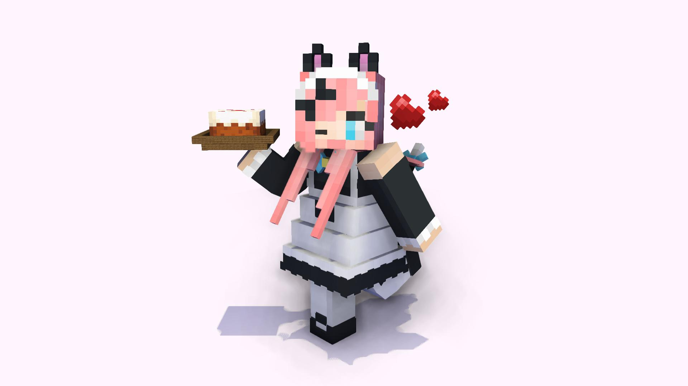
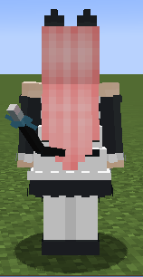
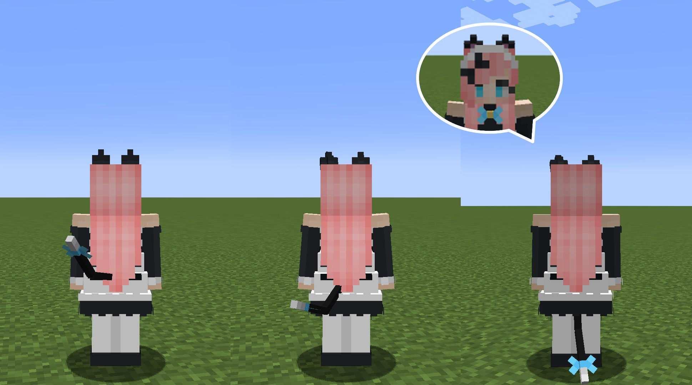
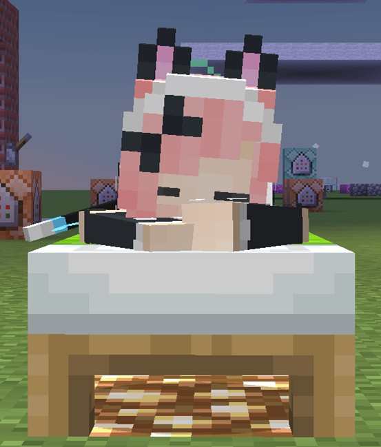
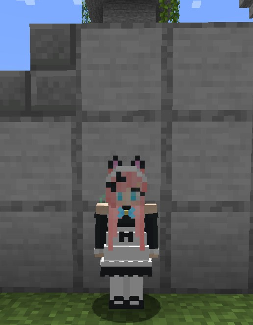
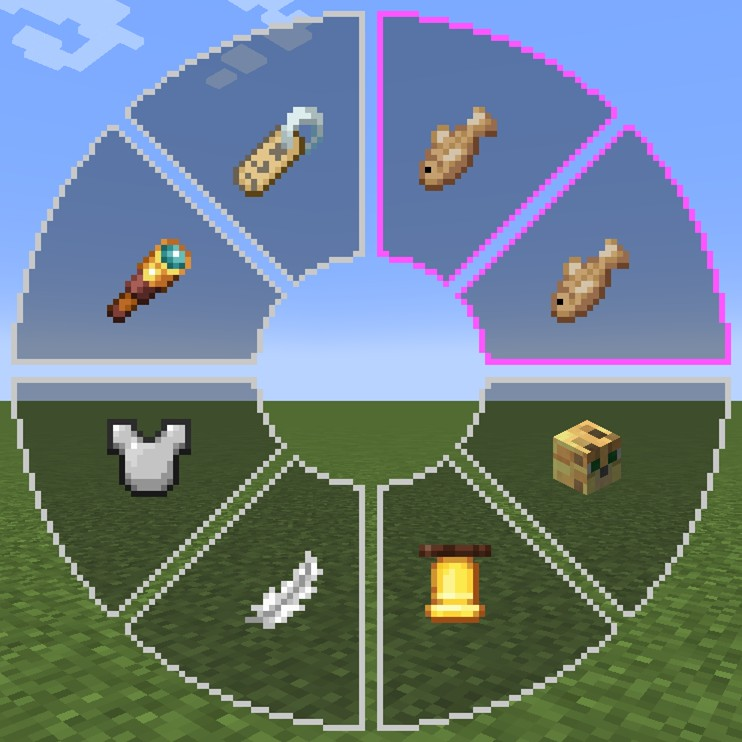
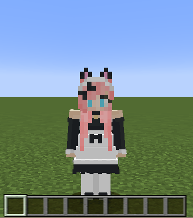
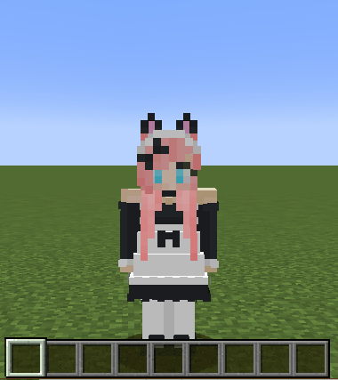
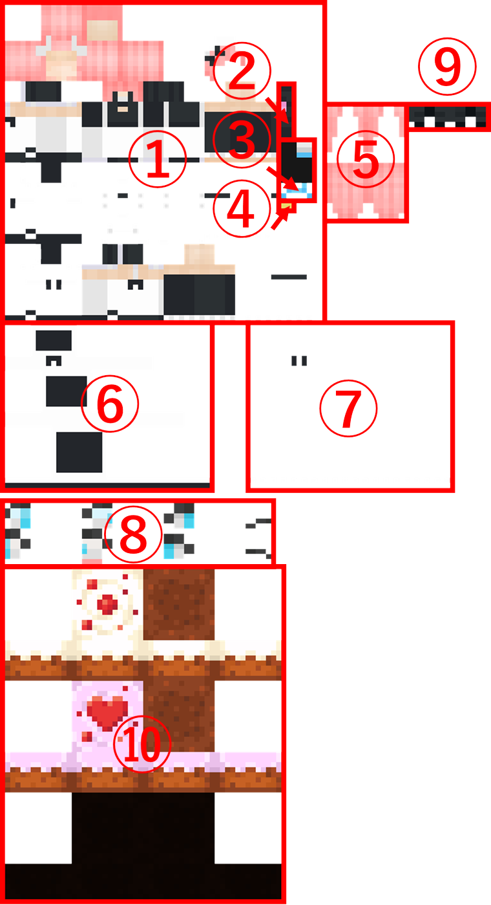

# CatMaid（猫メイド）
MinecraftのスキンMod「[Figura](https://github.com/Moonlight-MC/Figura)」向けスキン「CatMaid（猫メイド）」です。



## このブランチについて
このブランチは、[Figura公式Discordサーバー](https://discord.gg/ekHGHcH8Af)において、Felicia#4594さんより[リクエスト](https://discord.com/channels/805969743466332191/982872666925051914)を受けて作成されたものです。今後更新される[メインブランチ](https://github.com/Gakuto1112/CatMaid/tree/main)との互換性は原則としてありません。

このブランチは以下の点が[メインブランチ](https://github.com/Gakuto1112/CatMaid/tree/main)と異なります。

- モデルのサイズを変更出来ます。
- メッセージが英語になっています。

## 特徴
- 猫耳と尻尾とメイドスカートが追加されています。
  - 耳はたまにアニメーションします。
  - 尻尾は左右に振れます（[アクションバー](#アクションバー)で無効に出来ます）。

	
  （画像は古いバージョンのものです。）

  - 尻尾は現在のHP、満腹度に応じて上げ下げされます。

	
  （画像は古いバージョンのものです。）

- 時々にゃーにゃー鳴きます。
  - 鳴く時は口が開きます。
  - 低HP時、低満腹度時は声が変化します。
- 時々耳が動きます。
  - プレイヤーの利き手に応じてどちらが動くかが変化します。
- 時々瞬きします。
- ダメージを受けた時、低HP時、低満腹度時に目が変化します。
- [アクションバー](#アクションバー)でニッコリしたり、ウィンクしたりします。
- 歩いたり、跳んだりすると鈴の音がなります（[アクションバー](#アクションバー)で無効に出来ます）。
  - スニーク時は音量が1/5になります。
- ダメージを受けると「ネコがダメージを受ける」サウンドが再生されます。
- 就寝時は猫っぽく寝ます。
  - 就寝時の視点もポーズに合わせて変更されています。
  - 就寝時はゴロゴロ言います。

	

- プレイヤーが動くと髪がたなびきます。

**以下はこのブランチのみでの特徴です。**

- モデルのサイズを動的に変更出来ます。



## アクションバー
このスキンにはいくつかのアクションが用意されています。



### アクション1：「ニャー」と鳴く（スマイル）
ネコの鳴き声が再生されると同時に笑顔になります。



### アクション2：「ニャー」と鳴く（ウィンク）
ネコの鳴き声が再生されると同時にウィンクします。



### アクション3：鳴き声の切り替え
通常時の鳴き声のオン/オフを切り替えます。

### アクション4：鈴の音の切り替え
鈴の音のオン/オフを切り替えます。

### アクション5：尻尾振りの切り替え
尻尾振りのオン/オフを切り替えます。

### アクション6：防具表示の切り替え
防具を表示/非表示（に）します。

### アクション7：カメラの位置の変更
一人称視点/三人称視点のカメラの位置を、デフォルトの位置とモデルのサイズを考慮した位置との間で切り替えます。  
[**注意**]
- 実際の標準（クロスヘア）の位置は変更されません。
- サーバーによっては、カメラの位置を変更する事は**禁止されています**。使用する際は十分ご注意下さい。

### アクション8：名前の切り替え
表示名をプレイヤー名とスキン名との間で切り替えます。このスキン名は「**Vinny**」です。

**注意** スキン名はFiguraを導入しているかつ、あなたの信用度をTrustedに設定しているプレイヤーにのみに表示されます。それ以外のプレイヤーには通常のプレイヤー名が表示されます。また、サーバー側にはスキン名は反映されません。

## コマンド
このスキンにはコマンドが用意されています。コマンドの接頭語は「**?**」です。

### ```?scale <value>```
モデルのサイズを変更します。0より大きい値を受け付けます。

## テクスチャ



1. バニラスキン
   - スリムモデルのみ対応です。
   - クラッシックモデルの右腕パーツの端から2ピクセルが被らないようにして下さい。
   - 目（と口）は分離して8に描いて下さい。
2. 猫耳
3. 尻尾
4. 鈴
5. 前髪と後ろ髪
6. メイドスカート
7. メイドスカートのオーバーレイ
8. 目と口
   - 上から右目、左目、口です。
   - 目と口だけは他の部位と比べて2倍の解像度になっています。
   - 目は左から、通常の目、ダメージを受けた時の目、低HP時、低満腹度時の目、閉じている目です。
   - 口は左から閉じている口、開いている口です。
9. 背中のリボン

## クレジット
- 鈴の音：音人「鈴の音04」（ https://on-jin.com/sound/sei.php?bunr=%E3%83%99%E3%83%AB%E3%83%BB%E9%90%98%E3%83%BB%E9%88%B4&kate=%E9%81%93%E5%85%B7 ）