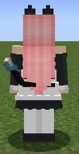
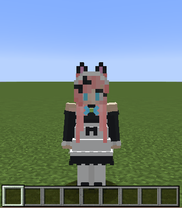

# CatMaid（猫メイド）

MinecraftのスキンMod「[Figura](https://github.com/Moonlight-MC/Figura)」向けスキン「CatMaid（猫メイド）」です。

**このアバターは上位の権限を必要とします。Figuraの信用度設定のUntrustedでは正常に表示されません。**


## このブランチについて
このブランチのアバター、[Figura Rewrite版（v0.1.0）](https://github.com/Kingdom-of-The-Moon/FiguraRewriteRewrite)向けのアバターです。[Figura Prewrite版（v0.0.8）](https://github.com/Moonlight-MC/Figura)では使用出来ません。[Figura Prewrite版（v0.0.8）](https://github.com/Moonlight-MC/Figura)のアバターを使用したい場合は、[こちら](https://github.com/Gakuto1112/CatMaid)からダウンロードして下さい。

また、[Figura Rewrite版（v0.1.0）](https://github.com/Kingdom-of-The-Moon/FiguraRewriteRewrite)の機能不足により、一部の機能は現時点（2022/7/18）では実装できませんでした。

### 実装不可能なもの
- 設定画面（詳しくは[こちら](#アバター設定について)）
- マルチプレイにおける、クライアント間のアクション同期（ping）
  - 相手に向かってエモートを実行しても相手はそのエモートを見ることが出来ません。
- プレイヤーの頭（被り物）の消去
- アクションホイールでの、顔アニメーションによるエモートのプレビュー
  - 代替のアイコンを使用しています。
- 暗闇で目が光る機能
  - リセットする方法がありませんでした。
- エリトラや手持ちアイテムの移動
  - 代替処理として、移動が必要な場合は非表示にしています。
  - オウムと望遠鏡はどうにもなりませんでした。

## 特徴
- 猫耳と尻尾とメイドスカートが追加されています。
  - 耳はたまにアニメーションします。
  - 尻尾は左右に振れます（[アクションバー](#アクションバー)で無効に出来ます）。

	

  - 尻尾は現在のHP、満腹度に応じて上げ下げされます。

	

- 時々にゃーにゃー鳴きます。
  - 鳴く時は口が開きます。
  - 低HP時、低満腹度時は声が変化します。
- 時々耳が動きます。
  - プレイヤーの利き手に応じてどちらが動くかが変化します。
- 時々瞬きします。
- ダメージを受けた時、低HP時、低満腹度時に目が変化します。
- [アクションバー](#アクションバー)でニッコリしたり、ウィンクしたりします。
  
  

- 歩いたり、跳んだりすると鈴の音がなります（[アクションバー](#アクションバー)で無効に出来ます）。
  - スニーク時は音量が1/5になります。
- ダメージを受けると「ネコがダメージを受ける」サウンドが再生されます。
- お気に入りの食べ物を手に持つと目がキラキラ光り、食べると満足して「ニャー」と鳴きます。

  

- 就寝時は猫っぽく寝ます。
  - 就寝時の視点もポーズに合わせて変更されています。
  - 就寝時はゴロゴロ言います。

	

- ケーキの持ち方がメイドっぽくなっています。
  - たまにレアなデザインのケーキが出現します。

  

- 水に触れると「ずぶ濡れ」状態になります。
  - 水から上がった時に「ブルブル」アクションをすると体に付いた水滴を飛ばせます。

  

- ウォーデンが近くにいる（暗闇デバフを受ける）と、怯えて震えます。
  - この状態では、鈴を押さえて音が出ないようにしたり（首を絞めている訳ではないよ！）、エモートを拒否するようになります。

  

  

- 放置するとアクションを起こします。
  - 30秒おきに鈴をいじります。

  

  - 5分放置すると居眠りします。

  
  
  

- プレイヤーが動くと髪がたなびきます。

  

## アクションホイール
このスキンにはいくつかのアクションが用意されています。


### アクション1：「ニャー」と鳴く（スマイル）
ネコの鳴き声が再生されると同時に笑顔になります。


### アクション2：「ニャー」と鳴く（ウィンク）
ネコの鳴き声が再生されると同時にウィンクします。


### アクション3：「ニャー」と鳴く（キラキラ）
ネコの鳴き声が再生されると同時に目を輝かせます。



### アクション4：おすわり
その場に座ります。もう一度アクション実行で立ち上がります。座っている時に動いたり、ジャンプしたり、スニークしたりすると自動で立ち上がります。


### アクション5：ブルブル
体をブルブル震わせます。体が濡れている場合は、水から上がった時にこのアクションを行うことで体に付いた水分を飛ばせます。


### アクション6：設定画面を開く
~~クリックして設定画面を開きます。~~

**2022/7/18現在、機能していません！！**

## アバター設定について
2022/7/18現在、ゲーム内での設定画面が実装出来ないので、代わりに[設定画面ファイル（./scripts/config.lua）](./scripts/config.lua)を直接編集して下さい。

- 設定値以外の所は編集しないで下さい。正常に動作しなくなるもとになります。

```lua
ConfigClass.SkinName = "Vinny"
ConfigClass.Language = "jp"
ConfigClass.MeowSound = true
ConfigClass.BellSound = true
ConfigClass.WaveTail = true
ConfigClass.HideArmor = true
ConfigClass.AutoShake = true
ConfigClass.UseSkinName = true
```

| 項目 | 説明 | 有効な値 | 初期値 |
| - | - | - | - |
| ```ConfigClass.SkinName``` | ```ConfigClass.UseSkinName```が```true```の時に使用される名前です。 | ```string``` | Vinny |
| ```ConfigClass.Language``` | アバターのメッセージやアクションホイールのアクション名に使用される言語です。 **If you want to use English, please set to "en"!** | ```string``` "en", "jp" | jp |
| ``` ConfigClass.MeowSound ``` | 定期的に猫の鳴き声を発するかどうかです。 | ```boolean``` | ```true``` |
| ```ConfigClass.BellSound``` | 鈴の音を鳴らすかどうかです。**カスタムサウンドを再生する権限が無い場合は代替の音が使用されます。** | ```boolean``` | ```true``` |
| ```ConfigClass.WaveTail``` | 尻尾を揺らすかどうかです。 | ```boolean``` | ```true``` |
| ```ConfigClass.HideArmor``` | 防具を隠すかどうかです。 | ```boolean``` | ```true``` |
| ```ConfigClass.AutoShake``` | 水から上がった時に自動でブルブルアクションを実行するかどうかです。 | ```boolean``` | ```true``` |
| ```ConfigClass.UseSkinName``` | ```ConfigClass.SkinName```をプレイヤー名として使用すかどうかです。**スキン名はFiguraを導入しているかつ、あなたの信用度をTrustedに設定しているプレイヤーにのみに表示されます。それ以外のプレイヤーには通常のプレイヤー名が表示されます。また、サーバー側にはスキン名は反映されません。** | ```boolean``` | ```true``` |

## テクスチャ
このアバターのテクスチャは以下の通りです。バニラのスキンをベースに作られているので、テクスチャを書き換えてスキンを変更出来ます。なお、バニラスキンと直接かかわりがあるもののみ説明します。

### [main.png](./textures/main.png)
アバターのメイン部分となるテクスチャです。


1. バニラスキン
   - スリムモデルのみ対応です。
   - クラッシックモデルの右腕パーツの端から2ピクセルが被らないようにして下さい。
   - 目（と口）は分離して8に描いて下さい。
2. 猫耳
3. 尻尾
4. 鈴
5. 前髪
6. 後ろ髪
7. 背中のリボン
8. メイドスカート
9. メイドスカートのオーバーレイ

### [eyes.png](./textures/eyes.png)
アバターの目のテクスチャです。


- 上から右目の光らない部分、右目の光る部分、左目の光らない部分、左目の光る部分、口です。
- 目と口だけは他の部位と比べて2倍の解像度になっています。
- 目は左から、通常の目、キラキラした目、ダメージを受けた時の目、低HP時、低満腹度時の目、眠い時の目、閉じている目です。

### [mouths.png](./textures/mouths.png)
アバターの口のテクスチャです。


左から閉じている口、開いている口です。

## おことわり
マルチプレイでの動作も考慮して作成はしていますが、実際に動作を検証出来る環境が無いため、マルチプレイでの動作検証は出来ていません。もし、マルチプレイでの不具合（一般的な不具合も歓迎です）がありましたら、[Issues](https://github.com/Gakuto1112/CatMaid/issues)での不具合報告をして頂ければ幸いです。

## クレジット
- 鈴の音：音人「鈴の音04」（ https://on-jin.com/sound/sei.php?bunr=%E3%83%99%E3%83%AB%E3%83%BB%E9%90%98%E3%83%BB%E9%88%B4&kate=%E9%81%93%E5%85%B7 ）