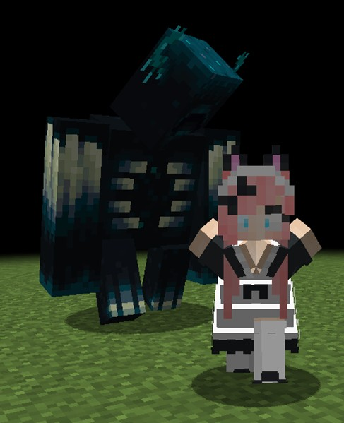

# CatMaid（猫メイド）
（2022/6/27更新）[Figura Rewrite版への対応の予定](#figura-rewrite版について)を掲載しました。

MinecraftのスキンMod「[Figura](https://github.com/Moonlight-MC/Figura)」向けスキン「CatMaid（猫メイド）」です。

**このアバターは上位の権限を必要とします。Figuraの信用度設定のUntrustedでは正常に表示されません。また、同信用度ではリソース超過によるエラーが発生する可能性があります。**

## 特徴
- 猫耳と尻尾とメイドスカートが追加されています。
  - 耳はたまにアニメーションします。
  - 尻尾は左右に振れます（[アクションバー](#アクションバー)で無効に出来ます）。

	
  （画像は古いバージョンのものです。）

  - 尻尾は現在のHP、満腹度に応じて上げ下げされます。

	
  （画像は古いバージョンのものです。）

- 時々にゃーにゃー鳴きます。
  - 鳴く時は口が開きます。
  - 低HP時、低満腹度時は声が変化します。
- 時々耳が動きます。
  - プレイヤーの利き手に応じてどちらが動くかが変化します。
- 時々瞬きします。
- ダメージを受けた時、低HP時、低満腹度時に目が変化します。
- [アクションバー](#アクションバー)でニッコリしたり、ウィンクしたりします。
  
  

- 歩いたり、跳んだりすると鈴の音がなります（[アクションバー](#アクションバー)で無効に出来ます）。
  - スニーク時は音量が1/5になります。
- ダメージを受けると「ネコがダメージを受ける」サウンドが再生されます。
- 就寝時は猫っぽく寝ます。
  - 就寝時の視点もポーズに合わせて変更されています。
  - 就寝時はゴロゴロ言います。

	

- ケーキの持ち方がメイドっぽくなっています。
  - たまにレアなデザインのケーキが出現します。

  

- 水に触れると「ずぶ濡れ」状態になります。
  - 水から上がった時に「ブルブル」アクションをすると体に付いた水滴を飛ばせます。

  

- ウォーデンが近くにいる（暗闇デバフを受ける）と、怯えて震えます。
  - この状態では、鈴を押さえて音が出ないようにしたり（首を絞めている訳ではないよ！）、エモートを拒否するようになります。

  

  

- 放置するとアクションを起こします。
  - 30秒おきに鈴をいじります。

  

  - 5分放置すると居眠りします。

  
  
  

- プレイヤーが動くと髪がたなびきます。

  

- 暗視が付与されている時は、猫のように目が光ります。
  - 暗視の仕様上、自分自身では目が光るのを確認できません。

  

## アクションホイール
このスキンにはいくつかのアクションが用意されています。

### アクション1：「ニャー」と鳴く（スマイル）
ネコの鳴き声が再生されると同時に笑顔になります。

### アクション2：「ニャー」と鳴く（ウィンク）
ネコの鳴き声が再生されると同時にウィンクします。

### アクション3：ビックリする
ビックリして汗をかきます。

### アクション4：おすわり
その場に座ります。もう一度アクション実行で立ち上がります。座っている時に動いたり、ジャンプしたり、スニークしたりすると自動で立ち上がります。

### アクション5：ブルブル
体をブルブル震わせます。体が濡れている場合は、水から上がった時にこのアクションを行うことで体に付いた水分を飛ばせます。

### アクション8：設定画面を開く
クリックして[設定画面](#設定画面)を開きます。

## 設定画面
アバターの各種設定が行えます。オンになっている項目は緑色で、オフになっている項目は赤色で表示されます。

### アクション1：鳴き声の切り替え
通常時の鳴き声のオン/オフを切り替えます。

### アクション2：鈴の音の切り替え
鈴の音のオン/オフを切り替えます。

### アクション3：尻尾振りの切り替え
尻尾振りのオン/オフを切り替えます。

### アクション4：防具表示の切り替え
防具を表示/非表示（に）します。

### アクション5：名前の切り替え
表示名をプレイヤー名とスキン名との間で切り替えます。このスキン名は「**Vinny**」です。

**注意** スキン名はFiguraを導入しているかつ、あなたの信用度をTrustedに設定しているプレイヤーにのみに表示されます。それ以外のプレイヤーには通常のプレイヤー名が表示されます。また、サーバー側にはスキン名は反映されません。

### アクション8：設定画面を閉じる
クリックして設定画面を閉じ、[アクションホイール](#アクションホイール)に戻ります。

## テクスチャ
このアバターのテクスチャは以下の通りです。バニラのスキンをベースに作られているので、テクスチャを書き換えてスキンを変更出来ます。

1. バニラスキン
   - スリムモデルのみ対応です。
   - クラッシックモデルの右腕パーツの端から2ピクセルが被らないようにして下さい。
   - 目（と口）は分離して8に描いて下さい。
2. 猫耳
3. 尻尾
4. 鈴
5. 前髪
6. 後ろ髪
7. 背中のリボン
8. メイドスカート
9. メイドスカートのオーバーレイ
10. 目と口
    - 上から右目の光らない部分、右目の光る部分、左目の光らない部分、左目の光る部分、口です。
    - 目と口だけは他の部位と比べて2倍の解像度になっています。
    - 目は左から、通常の目、ダメージを受けた時の目、低HP時、低満腹度時の目、眠い時の目、閉じている目です。
    - 口は左から閉じている口、開いている口です。
11. ケーキ
12. アクションホイールのアニメーション用の顔

## おことわり
マルチプレイでの動作も考慮して作成はしていますが、実際に動作を検証出来る環境が無いため、マルチプレイでの動作検証は出来ていません。もし、マルチプレイでの不具合（一般的な不具合も歓迎です）がありましたら、[Issues](https://github.com/Gakuto1112/CatMaid/issues)での不具合報告をして頂ければ幸いです。

## Figura Rewrite版について
現在、[公式Discordサーバー](https://discord.com/invite/ekHGHcH8Af)にて、Figuraの時期アップデート版（v0.1.0）となるRewrite版のプレリリースが公開されています。Rewrite版では、[モデル](/player_model.bbmodel)や[Luaスクリプト](/script.lua)仕様が抜本的に異なるため、このアバターがそのままでは使用出来ず、[Luaスクリプト](/script.lua)を大幅に書き換える必要があります。

しかし、現在のRewrite版ではこのアバターを満足に再現出来るだけの機能が備わっていないため、Rewrite版への対応を見送っています。Rewrite版が正式リリースに近づき、機能やドキュメントが充実してきた頃に対応させたいと思います。また、Rewrite版では各リソースファイル（[モデル](/player_model.bbmodel)、[テクスチャ](/texture.png)、[Luaスクリプト](/script.lua)）の分割が可能なようなので、Rewrite版への対応時にこのアバターのリソースを整理しようと思っています。

## クレジット
- 鈴の音：音人「鈴の音04」（ https://on-jin.com/sound/sei.php?bunr=%E3%83%99%E3%83%AB%E3%83%BB%E9%90%98%E3%83%BB%E9%88%B4&kate=%E9%81%93%E5%85%B7 ）