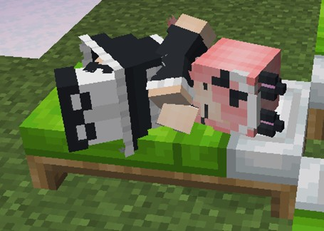

# CatMaid（猫メイド）
MinecraftのスキンMod「[Figura](https://github.com/Moonlight-MC/Figura)」向けスキン「CatMaid（猫メイド）」です。

## 特徴
- 猫耳と尻尾とメイドスカートが追加されています。
  - 耳はたまにアニメーションします。
  - 尻尾は左右に振れます（[アクションバー](#アクションバー)で無効に出来ます）。

	
  （画像は古いバージョンのものです。）

  - 尻尾は現在のHP、満腹度に応じて上げ下げされます。

	
  （画像は古いバージョンのものです。）

- 時々耳が動きます。
  - プレイヤーの利き手に応じてどちらが動くかが変化します。
- 時々瞬きします。
- ダメージを受けた時、低HP時、低満腹度時に目が変化します。
- [アクションバー](#アクションバー)でニッコリしたり、ウィンクしたりします。
- 歩いたり、跳んだりすると鈴の音がなります（[アクションバー](#アクションバー)で無効に出来ます）。
  - スニーク時は音量が1/5になります。
- ダメージを受けると「ネコがダメージを受ける」サウンドが再生されます。
- 就寝時は猫っぽく寝ます。
  - 就寝時の視点もポーズに合わせて変更されています。
  - 就寝時はゴロゴロ言います。

	

- プレイヤーが動くと髪がたなびきます。

## アクションバー
このスキンにはいくつかのアクションが用意されています。

### アクション1：「ニャー」と鳴く（スマイル）
ネコの鳴き声が再生されると同時に笑顔になります。

### アクション2：「ニャー」と鳴く（ウィンク）
ネコの鳴き声が再生されると同時にウィンクします。

### アクション3：鈴の音の切り替え
鈴の音のオン/オフの切り替えをします。

### アクション4：尻尾振りの切り替え
尻尾振りのオン/オフの切り替えをします。

### アクション5：防具表示の切り替え
防具を表示/非表示（に）します。

### アクション6：名前の切り替え
表示名をプレイヤー名とスキン名との間で切り替えます。このスキン名は「**Vinny**」です。

**注意** スキン名はFiguraを導入しているかつ、あなたの信用度をTrustedに設定しているプレイヤーにのみに表示されます。それ以外のプレイヤーには通常のプレイヤー名が表示されます。また、サーバー側にはスキン名は反映されません。

## テクスチャ

1. バニラスキン
   - スリムモデルのみ対応です。
   - クラッシックモデルの右腕パーツの端から2ピクセルが被らないようにして下さい。
   - 目（と口）は分離して8に描いて下さい。
2. 猫耳
3. 尻尾
4. 鈴
5. 前髪と後ろ髪
6. メイドスカート
7. メイドスカートのオーバーレイ
8. 目と口
   - 上から右目、左目、口です。
   - 目と口だけは他の部位と比べて2倍の解像度になっています。
   - 目は左から、通常の目、ダメージを受けた時の目、低HP時、低満腹度時の目、閉じている目です。
   - 口は左から閉じている口、開いている口です。

## クレジット
- 鈴の音：音人「鈴の音06」（ https://on-jin.com/sound/sei.php?bunr=%E3%83%99%E3%83%AB%E3%83%BB%E9%90%98%E3%83%BB%E9%88%B4&kate=%E9%81%93%E5%85%B7 ）