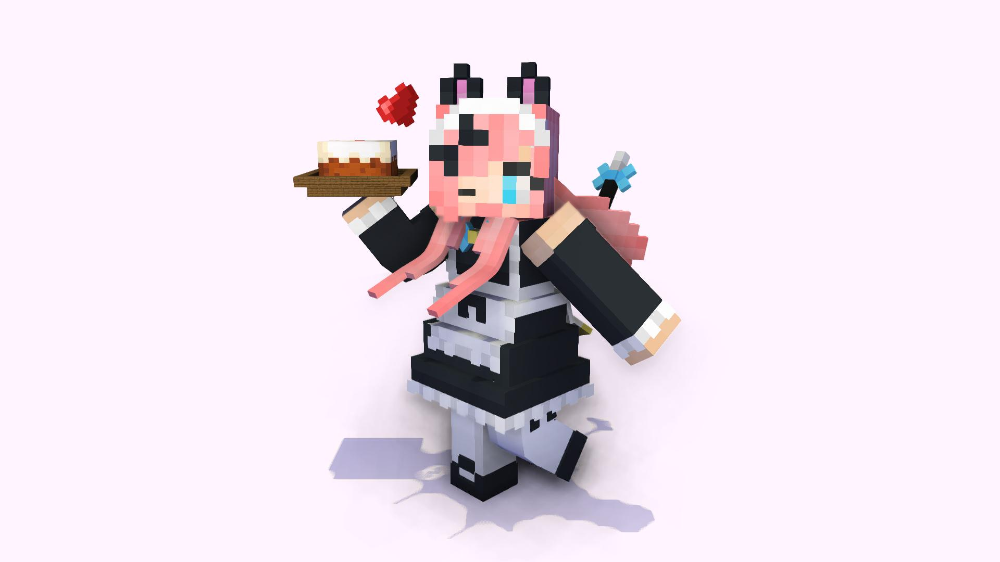
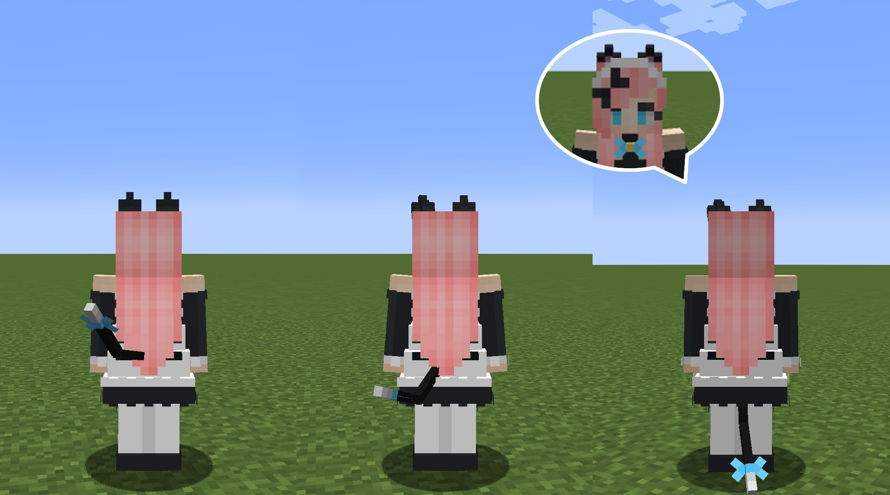

# CatMaid（猫メイド）
MinecraftのスキンMod「[Figura](https://github.com/Moonlight-MC/Figura)」向けスキン「CatMaid（猫メイド）」です。

## 特徴
- 猫耳と尻尾が追加されています。
  - 耳はたまにアニメーションします。
  - 尻尾は左右に振れます（[アクションバー](#アクションバー)で無効に出来ます）。

	

  - 尻尾は現在のHP、満腹度に応じて上げ下げされます。

	

- プレイヤーが動くと髪がたなびきます。
- 歩いたり、跳んだりすると鈴の音がなります（[アクションバー](#アクションバー)で無効に出来ます）。
  - スニーク時は音量が1/5になります。
- ダメージを受けると「ネコがダメージを受ける」サウンドが再生されます。

## アクションバー
このスキンにはいくつかのアクションが用意されています。

### アクション1：「ニャー」と鳴く
「ネコが鳴く」サウンドが再生されると同時にハートマークのパーティクルが表示されます。

### アクション2：鈴の音の切り替え
鈴の音のオン/オフの切り替えをします。

### アクション3：尻尾振りの切り替え
尻尾振りのオン/オフの切り替えをします。

## テクスチャ

1. バニラスキン
   - スリムモデルのみ対応です。
   - クラッシックモデルの右腕パーツの端から2ピクセルが被らないようにして下さい。
2. 猫耳
3. 尻尾
4. 鈴
5. 前髪
6. 後ろ髪

## クレジット
- 鈴の音：音人「鈴の音06」（ https://on-jin.com/sound/sei.php?bunr=%E3%83%99%E3%83%AB%E3%83%BB%E9%90%98%E3%83%BB%E9%88%B4&kate=%E9%81%93%E5%85%B7 ）